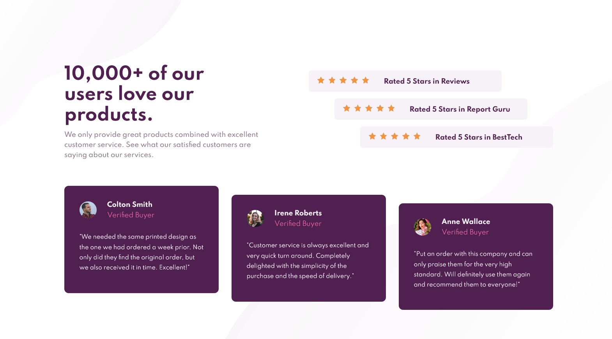

# Frontend Mentor - Social proof section solution

This is a solution to the [Social proof section challenge on Frontend Mentor](https://www.frontendmentor.io/challenges/social-proof-section-6e0qTv_bA). Frontend Mentor challenges help you improve your coding skills by building realistic projects. 

## Tabela de conteúdos

- [Panorama](#panorama-geral)
  - [O desafio](#o-desafio)
  - [Screenshot](#screenshot)
  - [Links](#links)
- [Meu processo](#meu-processo)
  - [Feito com](#feito-com)
  - [O que eu aprendi](#o-que-eu-aprendi)
  - [Conteúdos interessantes](#conteúdos-interessantes)
- [Autor](#autor)

## Panorama geral

### O desafio

- Construir a página de acordo com o design disponibilizado

### Screenshot




### Links

- Solution URL: [Solução](https://www.frontendmentor.io/solutions/social-proof-section-with-html-and-css-kC8MLLpJK)
- Live Site URL: [Site](https://social-proof-section-caducoder.vercel.app/)

## Meu processo

### Feito com

- HTML5 semântico
- CSS3 
- Flexbox

### O que eu aprendi

Aprendi a organizar o conteúdo de forma semântica utilizando tags apropriadas. Também melhorei meu entendimento sobre flexbox e responsividade.

```html
<main class="container">
      <section class="main-text">
        <p class="big-title">10,000+ of our users love our products.</p>
      </section>
</main>
```

```css
@media (max-width:500px){
   .container{
      width: 100%;
      height: max-content;
      padding: 0px 20px;
      display: flex;
      flex-wrap: nowrap;
      flex-direction: column;
      align-items: center;
   }
}
```

### Conteúdos Interessantes

- [Flexbox Froggy](https://flexboxfroggy.com/) - Este jogo me ajudou a entender melhor como funciona o flexbox. Gostei bastante e sempre que surgir uma dúvida irei utilizá-lo. Nada melhor do que aprender na prática.

## Autor

- Linkedin - [Carlos Silva](https://www.linkedin.com/in/carlos-edu/)
- Frontend Mentor - [@Cadulost](https://www.frontendmentor.io/profile/Cadulost)

